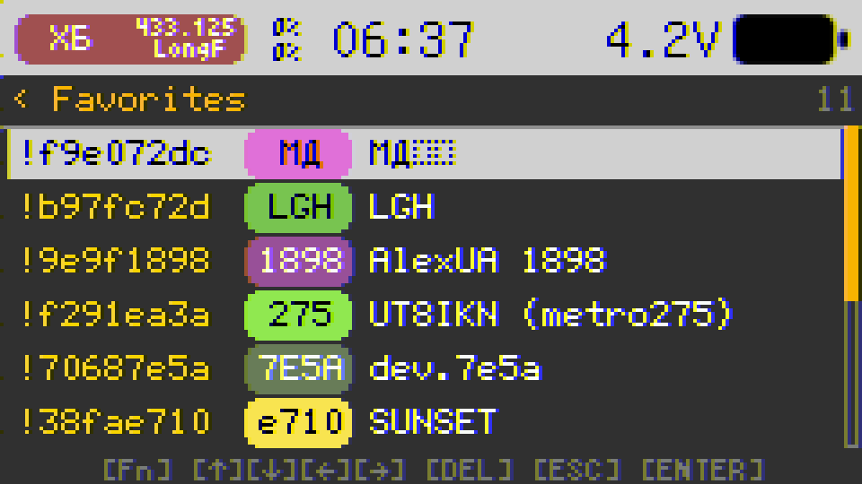
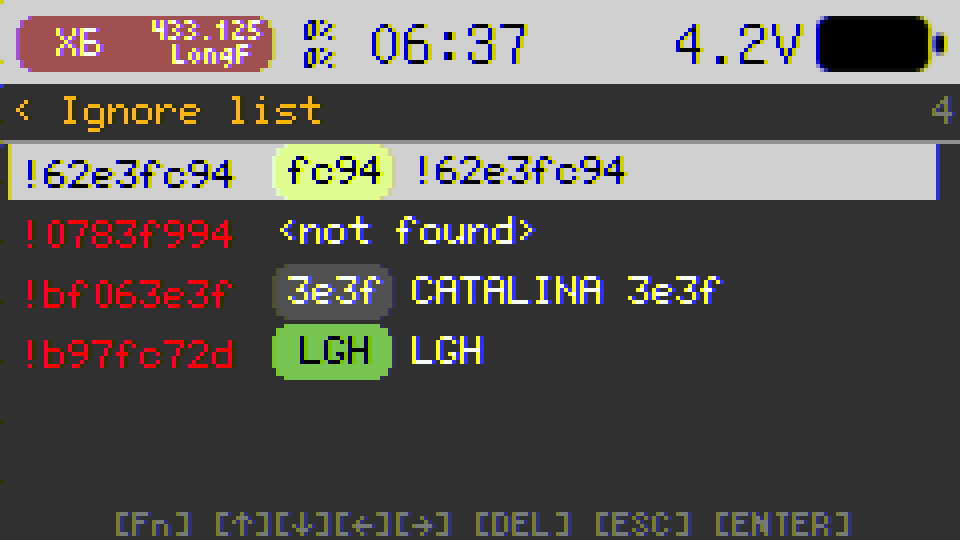
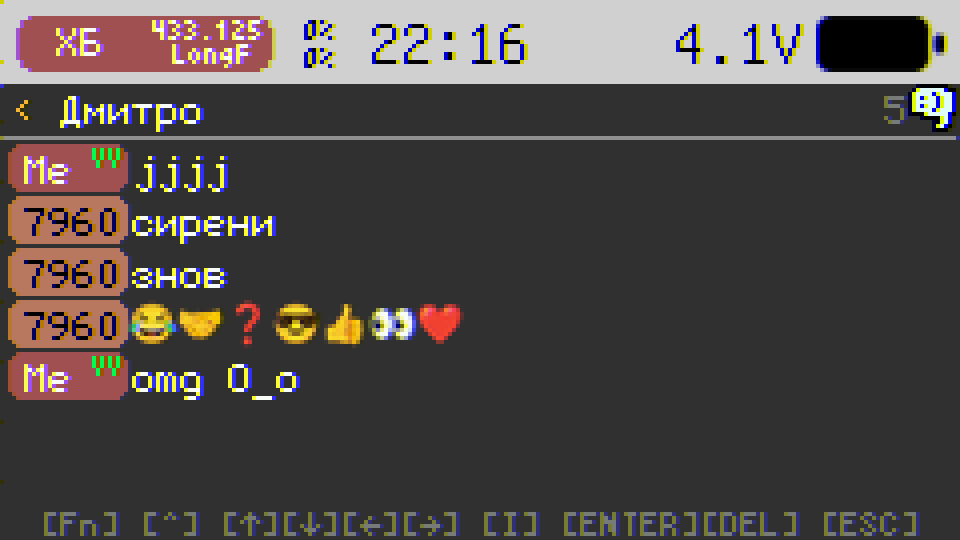
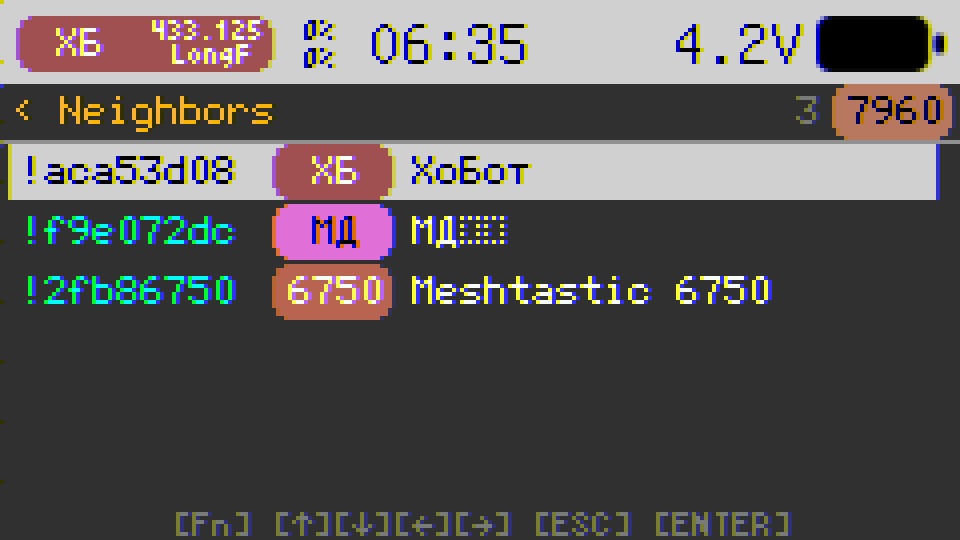
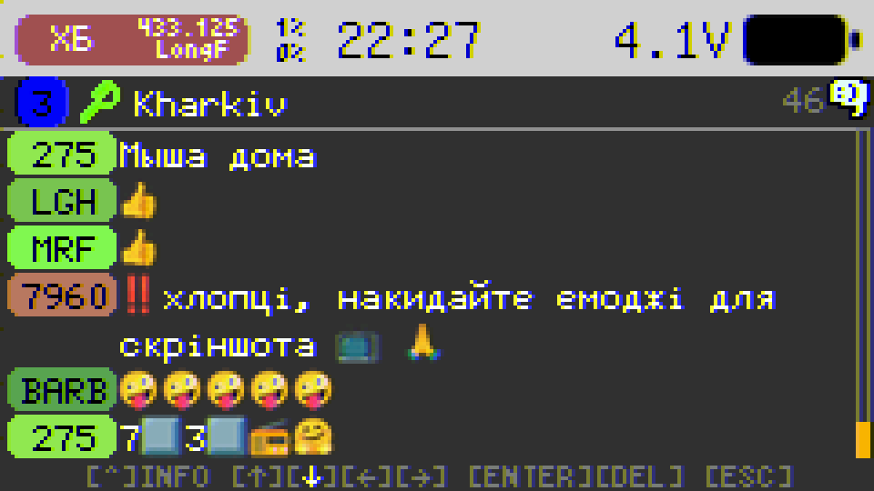
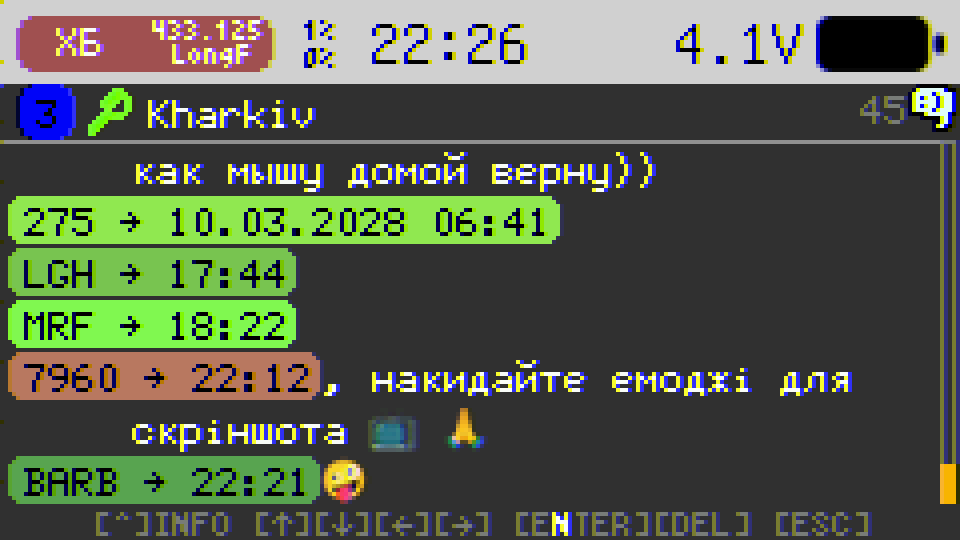

# Plai

**A standalone Meshtastic communicator for M5Stack CardPuter**

> _Plai_ is the Ukrainian word for a mountain trail — a reliable path for your data to travel when you're off the beaten track.

<p align="center">
  
</p>

Most Meshtastic nodes rely on a phone via BLE or WiFi. Plai takes a different approach: it turns the CardPuter into a **self-contained messaging terminal**. No phone required — just you, the LoRa CAP, and the keyboard.

## Why Plai?

- **Full standalone operation** — No WiFi, no BLE. Direct LoRa mesh communication with on-device UI.
- **Unlimited message history** — The entire profile, message history, and node database live on the SD card. Storage is limited only by your card size.
- **Swap and survive** — Reboot or switch firmwares without losing your place in the mesh. Everything persists on SD.
- **Pro navigation** — PgUp / PgDown / Home / End for fast scrolling through long threads and node lists.
- **Debug tools** — Built-in Packet Monitor (last 50 packets) and Trace Route history (last 50 attempts per node).
- **Custom alerts** — Individual channel notifications with distinct sounds.
- **Display sleep** — Screen turns off when idle to save power; wake on keypress or radio activity.
- **Stats app** — Tabbed overview: node info (incl. battery), system (heap, storage, uptime, **firmware version**), radio, node DB (**online nodes**, last hour), GPS, mesh port distribution, **running tasks**.
- **Fully compatible** with Meshtastic network v2.7+
- **Ping auto-reply**: respond automatically when someone #ping's the channel
- **New node greetings**: send a welcome broadcast to the channel and/or a Direct Message when a new node appears

## Apps

### Nodes

Full node management with up to 1000 nodes persisted on SD card.

<p align="center">
  
</p>
<p align="center">
  
</p>
<p align="center">
  
</p>
<p align="center">
  
</p>

- Node list with signal strength, hops, battery, role, encryption indicators
- **Remembers** last **sort order** and **selected node** across reboots
- 8 sorting modes (name, role, signal, hops, last heard, favorites first, etc.) _hotkey_ for sorting [1..8], [TAB] to select sorting mode
- Relay node display — see which node relayed each packet _hotkey_ [R] to jump to relay node
- Favorite marking and quick-jump navigation _hotkey_ [F] to toggle favorite
- Ignore nodes — mark nodes as ignored to filter their traffic _hotkey_ [I] to toggle ignored
- Node detail view with hardware model, position, and metrics _hotkey_ [Fn] + [ENTER] to open
- Direct Messages _hotkey_ [ENTER] to open
- Neighbors _hotkey_ [B] — exchange neighbor info with selected node; [Fn] + [B] open neighbors list view
- Exchange node info _hotkey_ [N] — send node info request to selected node
- Exchange position _hotkey_ [P] — send position request to selected node
- Traceroute _hotkey_ [T] to open recent traceroute logs. [Fn] + [T] to start traceroute immediately

#### Direct Messages

<p align="center">
  
</p>
<p align="center">
  
</p>

- Direct messaging with delivery status (pending → sent → ACK → delivered → failed)
- Channel invitation _hotkey_ [I] — invite the node to a channel (sends `#invite name=key` DM)
- Full keyboard input with Cyrillic layout support
- File-backed message history on SD card
- Clear chat _hotkey_ [BACKSPACE] to clear all messages
- Hold [CTRL] to display message info (**timestamps in local time**)

#### Traceroute

<p align="center">
  
</p>
<p align="center">
  
</p>

- Traceroute with hop-by-hop detail, round-trip duration, and SNR at each hop
- **Success sound** when a traceroute completes
- Last 50 traceroute attempts stored per node
- Visual route map with color-coded signal quality
- Press [T] to start new traceroute

#### Favorites list

Dedicated view of all your favorite nodes, stored persistently on SD card (`favorites.dat`).

- **Open** — [Fn] + [F] from node list
- **Add/remove** — [F] on a node in the main list toggles favorite status (shown in gold)
- **Navigation** — Arrow keys, [PgUp]/[PgDown] for page scroll, [Fn]+[↑] Home / [Fn]+[↓] End
- **Jump to node** — [ENTER] selects the highlighted favorite and returns to node list with that node focused
- **Remove** — [DEL] removes the selected favorite; [Fn]+[DEL] clears all favorites
- Favorites survive node database resets and firmware updates (file-backed)

#### Ignore list

Manage ignored nodes whose traffic is filtered at the mesh layer. Packets from ignored nodes are dropped before processing.

- **Open** — [Fn] + [I] from node list
- **Add/remove** — [I] on a node in the main list toggles ignored status (shown in red)
- Same navigation and shortcuts as favorites — [ENTER] jump to node, [DEL] remove selected, [Fn]+[DEL] clear all
- Ignored nodes stored in `ignorelist.dat` on SD; survives resets and updates

#### Neighbors

View direct neighbors (0-hop nodes) reported by each node via the `NEIGHBORINFO_APP` packet.

<p align="center">
  
</p>

- **Exchange** — [B] from node list — sends your direct neighbors and requests theirs back
- **Open list** — [Fn] + [B] from node list — shows cached neighbor data for the selected node
- **Navigation** — Arrow keys, [PgUp]/[PgDown] for page scroll, [Fn]+[↑] Home / [Fn]+[↓] End
- **Jump to node** — [ENTER] selects the highlighted neighbor and returns to node list with that node focused
- **Read-only** — The neighbor list is populated automatically from received `NEIGHBORINFO_APP` packets; no manual editing
- Each node's neighbor list stored in `neighbors/<node_id>.dat` on SD; cleaned up when the node is deleted

### Channels

Multi-channel group chat supporting up to 8 channels.

<p align="center">
  
</p>
<p align="center">
  
</p>
<p align="center">
  
</p>
<p align="center">
  
</p>
<p align="center">
  
</p>

- Channel list with unread message counts
- **Channel hash** — Each channel shows its hash (e.g. `#A3`) derived from name and PSK. Lets you see how the hash depends on settings and correlate packets in Monitor (packets display the same `#XX` channel byte).
- Channel creation _hotkey_ [Fn] + [SPACE] to open channel creation dialog
- Channel editing _hotkey_ [Fn] + [ENTER] to open channel editing dialog
- Channel chat _hotkey_ [ENTER] to open channel chat
- Individual notification sounds per channel (additional built-in alert tones)

#### New node greetings & #ping auto-reply

Many of us send "test test" and get no reply. Now Plai can reply automatically when you add **#ping** in your channel message — no more wondering if anyone's listening.

- **#ping auto-reply** — Add `#ping` anywhere in a channel message; Plai responds with a configurable template. Macros: `#short`, `#long`, `#id`, `#hops`, `#snr`, `#rssi`
- **New node greetings** — When a node appears for the first time (after receiving their NodeInfo), Plai can send a welcome broadcast to the channel and/or a Direct Message. Same macros apply.
- **Per-channel settings** — Each of the 8 channels has its own greeting and ping reply templates.

There are predefined templates for the greetings and ping reply. You can use them or enter your own custom text, holding [Fn] key.

Example: _"Look who is here! #long, welcome to HAM Community of Smartwill city. I can see you with #hops hops #snr/#rssi"_

#### Channel invitation

Share a channel with another node via Direct Message.

- **Sending** — In DM with a node, press [I]. Select a channel; Plai sends a DM in format `#invite name=base64_psk` (name max 11 chars, key base64-encoded). If the node has no public key, a confirmation is shown before sending unencrypted.
- **Receiving** — Enable **Settings → Security → Invitations**. When a DM starts with `#invite ` and matches `#invite channel_name=base64_psk`, Plai creates a new channel at the first free slot. Duplicate channels (same name and key) are ignored.
- Requires at least one free channel slot to accept an invitation.

### Monitor

Live radio packet feed for debugging and network analysis.

<p align="center">
  
</p>
<p align="center">
  
</p>
<p align="center">
  
</p>
<p align="center">
  
</p>

- Real-time TX/RX packet display with port labels (TEXT, POS, NODE, TELE, ROUT, TRAC, etc.)
- Channel hash (`#XX`) shown per packet — matches the hash in Channels for easy correlation
- Color-coded direction, node badges, and SNR indicators
- Color-coded packet ID for easy relay identification
- From/To node name resolution from NodeDB
- Scrollable packet list with detail drill-down view (**extra fields**, improved layout)
- Hold **[CTRL]** in packet list for **additional fields**
- Last 50 packets in a static ring buffer
- Select first item for autoscroll

### Stats

Network and system statistics in a tabbed view — at a glance diagnostics without leaving the mesh.

<p align="center">
  
</p>
<p align="center">
  
</p>
<p align="center">
  
</p>
<p align="center">
  
</p>
<p align="center">
  
</p>
<p align="center">
  
</p>
<p align="center">
  
</p>

- **Node** — Node ID, long/short name, role, PKI status, **battery** (when available)
- **System** — Heap (total/free/min), SD storage, uptime, date/time, **firmware version**
- **Radio** — Frequency, modem preset, waveform (SF/BW/CR), TX power, RX/TX packet counts
- **Node DB** — Total nodes, **online** (heard within the last hour), favorites, ignored, messages sent/received
- **GPS** — Fix quality, satellites (used/in view), coordinates, altitude, HDOP
- **Mesh** — Cumulative RX/TX and **port distribution** (Text, NodeInfo, Position, etc.) with percentages — counts reflect **all** packets seen by the radio stack, not a short rolling window; CRC errors shown separately
- **Tasks** — FreeRTOS tasks sorted by priority: name, **CPU core** (when enabled in IDF), **priority**, **stack high-water mark** (color hints when stack is tight)
- Tab navigation — [←][→] switch tabs; [↑][↓] scroll **any** tab with overflow
- Auto-refresh every 2 seconds

### Settings

Complete device and mesh configuration stores in NVS. You can export and import settings to SD card for backup and restore it later.

<p align="center">
  <b><span style="color:red;">&#x26A0;️</span> <span style="color:red;">Mesh keys are in NVS. Don't forget to backup them to SD card if you want to keep them after firmware update!</span></b>
</p>

Node database and chat history are stored on SD card and not affected by firmware updates.

<p align="center">
  
</p>

- System: brightness, volume, timezone
- LoRa: region, modem preset, TX power, hop limit
- Security: channel PSK management, invitations (auto-add channels from `#invite` DMs), **derive public key from private key** (X25519)
- Node info: name, short name, role
- Position: GPS enable, fixed position, broadcast interval. GPS time sync: callback-based; system clock updated from GPS only when drift exceeds 60 seconds
- Telemetry: device metrics broadcast
- Export/Import settings to SD card
- Clear all nodes
- UI: **GPS** status icon in the bar only when there is a **position fix**; footer **hints** restored on multi-choice dialogs

## Hardware

### Required

| Component                 | Description                              |
| ------------------------- | ---------------------------------------- |
| **M5Stack CardPuter ADV** | ESP32-S3 portable terminal with keyboard |
| **LoRa CAP**              | M5Stack SX1262 LoRa module (868/915 MHz) |
| **SD Card**               | For profile, messages, and node database |

## Install

Beta version is available in **M5Apps** (Installer → Cloud → Beta tests).

Standalone version will be added to **M5Burner** soon.

> Look for M5Apps in M5Burner.

## Mesh Protocol

Built from scratch on ESP-IDF — not a fork of the Meshtastic firmware.

- **Encryption**: AES-CTR with channel PSK, X25519 public-key cryptography
- **Multi-channel**: Up to 8 channels with individual PSKs
- **Routing**: Hop-limit flooding (1–7 hops) with Meshtastic-compatible duplicate detection
- **Reliability**: ACK/NACK with automatic retries, implicit ACK via rebroadcast
- **Priority TX queue**: ACK > Routing > Admin > Reliable > Default > Background
- **Duty cycle**: Channel and air utilization tracking
- **Channel activity**: Detects traffic on the configured channel; **default frequency slot** follows the primary channel name
- **TX pacing**: Configurable delay for **reply** traffic to reduce collisions
- **Roles**: Telemetry broadcasts are **not** sent for `CLIENT_HIDDEN` nodes
- **Multi-region**: US, EU_433, EU_868, CN, JP, ANZ, KR, TW, RU, IN, and more
- **Packet encoding**: Nanopb (Protocol Buffers) for full Meshtastic wire compatibility

## Building from Source

### Prerequisites

- [ESP-IDF v5.5.x](https://docs.espressif.com/projects/esp-idf/en/v5.5.3/esp32s3/get-started/) (project tested with **5.5.3**)
- ESP32-S3 target

### Build & Flash

```bash
idf.py set-target esp32s3
idf.py build
idf.py -p COMx flash monitor
```

### HAL Configuration

Hardware components can be individually toggled via menuconfig:

```bash
idf.py menuconfig
# Navigate to: HAL Configuration
```

| Option             | Default | Description                   |
| ------------------ | ------- | ----------------------------- |
| `HAL_USE_DISPLAY`  | on      | ST7789 display via LovyanGFX  |
| `HAL_USE_KEYBOARD` | on      | Keyboard input (requires I2C) |
| `HAL_USE_RADIO`    | on      | SX1262 LoRa radio             |
| `HAL_USE_SDCARD`   | on      | SD card (FAT/exFAT)           |
| `HAL_USE_GPS`      | on      | ATGM336H GPS                  |
| `HAL_USE_SPEAKER`  | on      | I2S audio output              |
| `HAL_USE_LED`      | on      | WS2812 RGB LED                |
| `HAL_USE_BAT`      | on      | Battery voltage monitor       |
| `HAL_USE_I2C`      | on      | I2C master bus                |
| `HAL_USE_BUTTON`   | on      | Home button                   |

## Project Structure

```
Plai/
├── main/
│   ├── apps/                  # Application layer
│   │   ├── launcher/          # Home screen & system bar
│   │   ├── app_nodes/         # Node list, DM, traceroute
│   │   ├── app_channels/      # Channel group chat
│   │   ├── app_monitor/       # Live packet feed
│   │   ├── app_stats/        # Network & system statistics
│   │   ├── app_settings/     # Configuration UI
│   │   └── utils/             # Shared UI components
│   ├── hal/                   # Hardware Abstraction Layer
│   │   ├── hal.h              # Base HAL class
│   │   ├── hal_cardputer.*    # M5Cardputer implementation
│   │   ├── display/           # LovyanGFX display driver
│   │   ├── keyboard/          # TCA8418 / IOMatrix drivers
│   │   ├── radio/             # SX1262 LoRa driver
│   │   └── ...                # GPS, speaker, LED, battery, etc.
│   ├── mesh/                  # Meshtastic protocol
│   │   ├── mesh_service.*     # Core mesh service
│   │   ├── node_db.*          # Node database (SD-backed)
│   │   ├── mesh_data.*        # Message store & packet log
│   │   └── packet_router.*    # Priority TX/RX queues
│   ├── meshtastic/            # Protobuf definitions (Nanopb)
│   ├── settings/              # NVS settings with cache
│   └── main.cpp               # Entry point
├── components/
│   ├── LovyanGFX/             # Display graphics library
│   ├── mooncake/              # App framework
│   └── Nanopb/                # Protocol Buffers
└── Kconfig.projbuild          # menuconfig HAL options
```

## Credits

- Fonts: [efont](https://openlab.ring.gr.jp/efont/) Unicode bitmap fonts from the Linux distribution
- Icons: Free icons by [Icons8](https://icons8.com)
- Sounds: [Epidemic Sound](https://www.epidemicsound.com/)
- Platform: [M5Stack](https://m5stack.com/) M5Cardputer

## License

This project is licensed under the [GNU General Public License v3.0](https://www.gnu.org/licenses/gpl-3.0.html) — see [LICENSE](LICENSE) for details.
