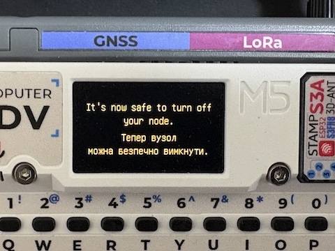

# What's Changed in Plai by t-miura

This document details the work and architectural changes integrated into the `development` branch of Plai in [my fork](https://github.com/t-miura/plai/). This branch focuses heavily on turning the [Plai](https://github.com/d4rkmen/plai) that runs on ESP32-S3-based Cardputer ADV with Cap LoRa-1262 into a more reliable, standalone Meshtastic node. Through meticulous memory optimization, concurrency management, and hardware power states, we've successfully addressed the constraints of a resource-limited environment (no PSRAM, 512KB SRAM) while maintaining the pristine design flow of the [upstream `main` codebase by d4rkmen](https://github.com/d4rkmen/plai/tree/main), most of changes comes with opt-in/out option in setting menu to let user choose each new behavior as much as possible.

## 1. Advanced Power Save & Light Sleep Integration

*This was our most difficult challenge to date.* To improve battery runtime, we had to implement true ESP32 Power Management and CPU Light Sleep.

* **Dynamic Frequency Scaling & Sleep**: We integrated `esp_pm` to dynamically scale the CPU between its 240MHz maximum and the 40MHz XTAL minimum, while allowing for true light sleep.
* **Intelligent PM Locks**: The system now intelligently acquires and releases an `esp_pm_lock_handle_t` (`_cpu_lock`). The CPU lock is held while the display or GPS module is active. Once the display turns off and the GPS sleeps, the system releases the lock.
* **Interrupt Safety**: A major hurdle was handling hardware interrupts during light sleep. We configured GPIO pin 11 (Keyboard) and pin 4 (Radio) with level-triggered wakeups right before sleep, and properly reverted them back to edge-triggered interrupts upon waking to avoid watchdog lockups.

## 2. Hardware & GPS Management

* **Sleep-able GPS**: The CASIC ATGM336H GPS module now properly respects software sleep modes via the `$PCAS12,65535` command when GPS is not in use. A 10-minute periodic wake-up task runs to ensure GPS module keep sleeping (`gps.cpp`). The NMEA message counter reliably stops when the GPS is sleeping. This behavior can be turned off via a setting to align with d4rkmen's code, also turning this into a very accurate GPS-based desk clock if the location is good enough to acquire a constant lock.
* **RTC Bootstrap & Periodic Sync**: We enabled ZDA sentences (`$PCAS03`) to rapidly sync the ESP32-S3 internal RTC utilizing the ATGM336H's 32kHz XTAL and supercapacitor-backed memory. Because the ESP32-S3's internal 8MD256 oscillator inherently drifts, and requiring users to hardware-mod a 32kHz XTAL onto the StampS3A goes against our "buy-and-flash" philosophy, we implemented a periodic software sync from the relatively reliable GPS RTC to continuously correct the internal clock drift. The ATGM336H's RTC keeps time accurately enough for more than days(may takes week to drift more than a second...nice clock indeed!) without acquiring a lock to get the actual time. However, users must be cautious not to drain its internal supercapacitor/battery; we recommend keeping the entire node on 24/7, if possible, to keep it fully charged.
* **Mesh Time Sync ("Desperate" Fallback)**: When the local clock is unset (e.g., due to a discharged supercapacitor), the system automatically sniffs incoming `Position` packets on the primary channel to synchronize the local RTC, without falsely triggering the UI's GPS lock indicator (`mesh_service.cpp`). This feature can also be opted out of via a setting, which is useful when there is a known node with a drifting clock sending inaccurate time data on their position packets. Future changes will reduce the risk of mistakenly syncing to a position packet by only allowing syncs via mesh when our clock is behind, just like the official Meshtastic firmware does. While this will have no effect on nodes that send advanced-than-actual time, we may need to establish a threshold separate from the GPS Time Sync's threshold as an additional safety measure.

## 3. System Stability & Concurrency Fixes

* **SD Card Occasional Restarts**: Accessing the SD card could occasionally cause restarts due to SPI contention. We manually pull up the CS pin (GPIO 12) during radio initialization and increased the SPI2 bus `max_transfer_sz` to 4092 bytes. We also reduced the SD card's SPI clock from 20MHz (the standard frequency for this mode) to 10MHz. While previous issues I experienced might be related to SanDisk-specific bugs with SPI mode, this new frequency matches the one used by the SX1262, so synchronizing the frequency should result in fewer issues.
* **Radio Buffer Stack Overflow Risk**: We removed severe stack overflow risks by eliminating large local `tx[256]` arrays inside LoRa helper functions, moving them to class-level shared members. We added a thread-safe `spiTransferLocked()` function that enforces mutex locks (`_spi_mutex`) around SPI access (`sx1262.cpp`).
* **Data Synchronization**: Prevented race conditions and torn reads during NMEA parsing by introducing a FreeRTOS `SemaphoreHandle_t`.

## 4. Memory Optimization & Crash Fixes

With limited memory (single-digit KB free heap on main), these optimizations were critical. The free heap now stabilizes between 76KB and 104KB during active usage.

* **Heap Exhaustion Mitigations**:
* Disabled unused mapping/tracking of RSSI points (`_rssi_history`), which previously consumed ~26KB of heap (`mesh_data.cpp`). I will revert this when d4rkmen introduces this data to be displayed, with possible tweaks to conserve heap.
* Switched to on-demand node indexing. Replaced the permanent boot-time 36KB `MAX_NODES` vector allocation with dynamic sizing (`node_db.cpp`).

* **(Revert Experiment in Progress) FATFS Configuration**: Changed `CONFIG_FATFS_SECTOR_4096` down to `CONFIG_FATFS_SECTOR_512` in `sdkconfig` to align with the physical sectors of the SD card, saving 3.5KB per open file handle and mitigating "SD card not found" errors. While it is confirmed that this significantly affects read/write operations, it is currently reverted to use 4096-byte sector access. Since we have freed enough heap from other efforts, it seems safe to re-introduce it, providing smoother use and possibly reducing the risk of lockups due to slow SD card access.
* **Unbuffered Streams**: Configured file-local `fopen` operations to run unbuffered (`_IONBF`) to bypass newlib's default 4KB heap-allocated buffer for C streams.
* **AppNodes `LoadProhibited` Panic**: Fixed crashes when exiting the node UI by thoroughly initializing garbage state variables (`_data` members) during `onCreate()` and replacing vulnerable pointer subtractions with safe, bounds-checked loops (`app_nodes.cpp`).

* **[EXPERIMENTAL] from newlibc to picolibc**: While it's in experimental thing, switching libc from newlibc to picolibc gives many benefits according to [Official Blog](https://developer.espressif.com/blog/2026/04/esp-idf-6-default-libc-picolibc/). So current codebase is using picolibc with some fixes on map loading/rendering logic to fill the gap between these two's behavior, and working fine with every single functions so far.

## 5. UI & User Experience Enhancements

* **Emoji Font Support (Ultra-Low Resolution)**: We implemented a mean-adaptive thresholding script (`emoji_converter.py`) to binarize 12x12 monochrome emojis reliably. The generated C++ arrays (`builtin_emojis.cpp`) are cleanly integrated via `emoji_draw_callback` for lightning-fast UI rendering without SD card lag. The original d4rkmen "emoji png from sdcard" feature is still active, so any missing emojis and other characters will be loaded from the SD card, just like the current upstream release does. We will add an option to disable "emoji-from-internal-font" to strictly use emojis from the SD card for a more visually pleasing look, in exchange for a slight delay on load (rest assured, there are up to 10 emojis cached in memory, just like upstream!).
* **Preferences Persistence**: The app now properly persists UI state across reboots using NVS. Node list sort order and map zoom preferences are stored in the `system` namespace (`settings.cpp`).
* **Map Zoom Stability**: Removed synchronous NVS writes from the fast key-repeat update loop, opting to only commit zoom settings to NVS upon exiting the map view. This eliminates UI freezing during rapid map navigation.
* **Key Clicks Toggle**: We added a configuration setting inside the standard **Settings → System** menu to toggle keyboard clicking sounds, intercepting playback inside the hardware abstraction layer while preserving standard alert tones.
* **Reboot / Shutdown Menu**: To safely reboot or power off the device, these two are now in ** Settings → Power **. Since we can't completely power off the whole device, shutdown will show Windows 95-esque splash screen to tell you it's safe to power down the device(either sliding battery switch to off, or unplug the USB-C if running only from it)
  * 
